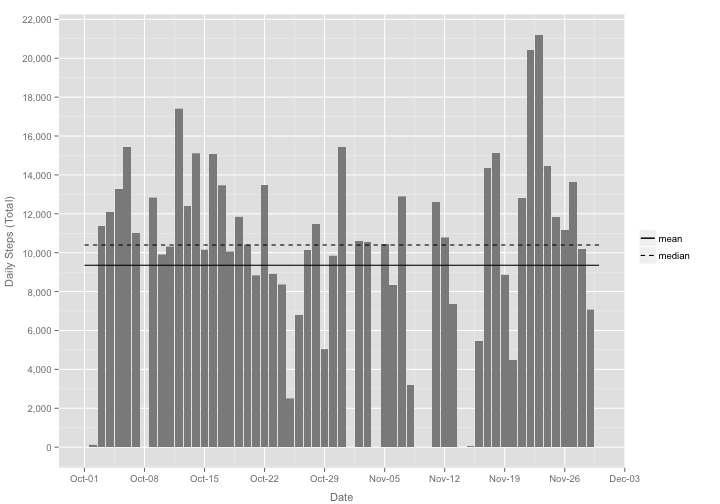
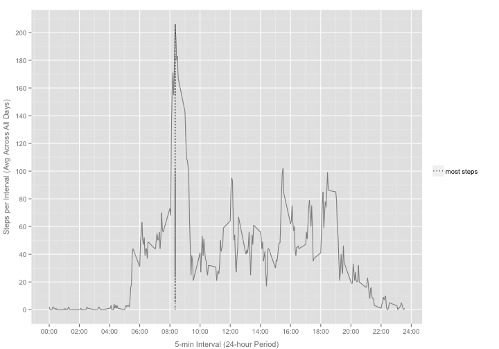
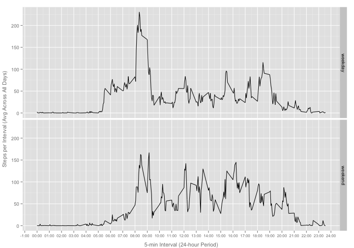

### Presets ###


```r
library(knitr)
opts_chunk$set(echo=TRUE, warning=FALSE, message=FALSE, fig.width=10)
```


```r
library(dplyr)
library(ggplot2)
library(scales)
```


## Loading and preprocessing the data


```r
df <- read.csv("activity.csv", colClasses=c("integer","Date","integer"))

# calculate: mean_total_steps, median_total_steps
# daily_total_steps is not used by ggplot so it's not saved in the data frame
# rather it is calculated by geom_bar()

ddf <- df %.%
    group_by(date) %.%
    summarise(daily_total_steps=sum(steps, na.rm=TRUE))

df$mean_total_steps <- ( ddf %.%
    summarise(mean_total_steps=round(mean(daily_total_steps, na.rm=TRUE))) )$mean_total_steps
df$median_total_steps <- ( ddf %.%
    summarise(median_total_steps=round(median(daily_total_steps, na.rm=TRUE))) )$median_total_steps

# calculate: mean_int_steps, max_int_steps_int

ddf <- df %.%
    group_by(interval) %.%
    summarise(mean_int_steps=round(mean(steps, na.rm=TRUE)))
df <- inner_join(df, ddf, by="interval")
df$max_int_steps_int <- df[df$mean_int_steps == max(df$mean_int_steps), "interval"][1]
```


## What is the mean total number of steps taken per day?


```r
legend <- c("mean"="solid", "median"="dashed")
p <- ggplot(df, aes(x=date, y=steps))
p <- p + geom_bar(stat="identity", fill="grey55")
p <- p + geom_line(stat="hline", aes(yintercept=mean_total_steps, linetype="mean"))
p <- p + geom_line(stat="hline", aes(yintercept=median_total_steps, linetype="median"))
p <- p + scale_y_continuous(breaks=pretty_breaks(n=10), labels=comma) +
        scale_x_date(breaks=pretty_breaks(n=10), labels=date_format("%b-%d")) +
        scale_linetype_manual(name="", values=legend)
p <- p + labs(x="Date", 
              y="Daily Steps (Total)") +
        theme(axis.title=element_text(size=11, color="grey50"), 
              axis.title.x=element_text(vjust=-0.5),
              axis.title.y=element_text(vjust=0.25))

p
```

 


## What is the average daily activity pattern?


```r
legend <- c("most steps"="dotted")
p <- ggplot(df, aes(x=interval, y=mean_int_steps))
p <- p + geom_line(color="grey55")
p <- p + geom_line(stat="vline", aes(xintercept=max_int_steps_int, linetype="most steps"))
p <- p + scale_y_continuous(breaks=pretty_breaks(n=10)) +
        scale_x_continuous(breaks=pretty_breaks(n=10), labels=function(x)paste(substr(sprintf("%04s",x),1,2),":",substr(sprintf("%04s",x),3,4),sep="")) + 
        scale_linetype_manual(name="", values=legend)
p <- p + labs(x="5-min Interval (24-hour Period)", 
              y="Steps per Interval (Avg Across All Days)") +
        theme(axis.title=element_text(size=11, color="grey50"), 
              axis.title.x=element_text(vjust=-0.5),
              axis.title.y=element_text(vjust=0.25))

p
```

 


## Imputing missing values

The total number of missing steps-measurements in the dataset is 2304. ( ```sum(is.na(df$steps))``` )


```r
# calculate: steps_imp

df$steps_imp <- df$steps
df[is.na(df$steps), "steps_imp"] <- df[is.na(df$steps), "mean_int_steps"]

# new dataset, equal to the original dataset but with the missing data filled in

df_imp <- df[,c("steps_imp", "date", "interval")]
names(df_imp) <- c("steps", "date", "interval")

# calculate: mean_total_steps, median_total_steps

ddf <- df_imp %.%
    group_by(date) %.%
    summarise(daily_total_steps=sum(steps, na.rm=TRUE))

df_imp$mean_total_steps <- ( ddf %.%
    summarise(mean_total_steps=round(mean(daily_total_steps, na.rm=TRUE))) )$mean_total_steps

df_imp$median_total_steps <- ( ddf %.%
    summarise(median_total_steps=round(median(daily_total_steps, na.rm=TRUE))) )$median_total_steps

legend <- c("mean"="solid", "median"="dashed")
p <- ggplot(df_imp, aes(x=date, y=steps))
p <- p + geom_bar(stat="identity", fill="grey55")
p <- p + geom_line(stat="hline", aes(yintercept=mean_total_steps, linetype="mean"))
p <- p + geom_line(stat="hline", aes(yintercept=median_total_steps, linetype="median"))
p <- p + scale_y_continuous(breaks=pretty_breaks(n=10), labels=comma) +
        scale_x_date(breaks=pretty_breaks(n=10), labels=date_format("%b-%d")) +
        scale_linetype_manual(name="", values=legend)
p <- p + labs(x="Date", 
              y="Daily Steps (Total)") +
        theme(axis.title=element_text(size=11, color="grey50"), 
              axis.title.x=element_text(vjust=-0.5),
              axis.title.y=element_text(vjust=0.25))

p
```

 

What is the impact of imputing missing data on the estimates of the total daily number of steps?

In the case of a lot of missing measurements per day, the total daily number of 
steps can change dramatically.

## Are there differences in activity patterns between weekdays and weekends?


```r
# calculate: day_of_week (weekday or weekend ?)
# calculate: mean_total_steps_imp per day_of_week

df_imp$day_of_week <- "weekday"
df_imp[weekdays(df_imp$date) %in% c("Saturday", "Sunday"), ]$day_of_week <- "weekend"
df_imp$day_of_week <- factor(df_imp$day_of_week)

ddf <- df_imp %.%
    group_by(interval, day_of_week) %.%
    summarise(mean_int_steps=mean(steps))

df_imp <- inner_join(df_imp, ddf, by=c("interval", "day_of_week"))

p <- ggplot(df_imp, aes(x=interval, y=mean_int_steps))
p <- p + geom_line()
p <- p + facet_grid(day_of_week ~ .)
p <- p + scale_x_continuous(breaks=pretty_breaks(n=24), 
                            labels=function(x) paste(substr(sprintf("%04s",x),1,2),":",substr(sprintf("%04s",x),3,4),sep="")) + 
        scale_linetype_manual(name="", values=legend)
p <- p + labs(x="5-min Interval (24-hour Period)", 
              y="Steps per Interval (Avg Across All Days)") +
        theme(axis.title=element_text(size=11, color="grey50"), 
              axis.title.x=element_text(vjust=-0.5),
              axis.text.x=element_text(size=8),
              axis.title.y=element_text(vjust=0.25))
p
```

 

